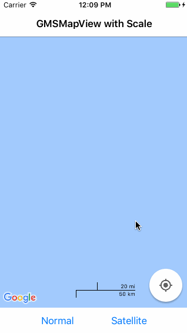

# CHGMapView: a GMSMapView with a graphical scale

## Example



## Usage

Simply download and add the sources for [CHGMapView.h/.m](/GMSMapViewScale_Example/GMSMapViewScale_Example) to your project. Import CHGMapView.h and build a GMSMapView as you normally would do with a GMSMapView. Take a look at [GMSMapViewScale_Example](/GMSMapViewScale_Example/GMSMapViewScale_Example) to see a full running example.

```objc
#import "CHGMapView.h"
...
- (void)loadView
{
    GMSCameraPosition *camera = [GMSCameraPosition cameraWithLatitude:-33.86
                                                            longitude:151.20
                                                                 zoom:6];

    CHGMapView *mapView = [CHGMapView mapWithFrame:CGRectZero camera:camera]; // use the CHGMapView instead of GMSMapView

    mapView.myLocationEnabled = YES;
    mapView.settings.myLocationButton = YES;

    self.view = mapView;
}
```

## Restrictions

Tested with iOS 10.3 and GoogleMaps SDK 2.2.0! But it should work with every iOS-Version which is compatible to any GoogleMaps SDK.

## License

CHGMapView is available under the MIT license. See the LICENSE file for more info.

## Author and contact

Christian Greth, greth.christian@googlemail.com
Feel free to contact me or write an issue if you encounter problems, need some more features or have any notes regarding this implementation.
